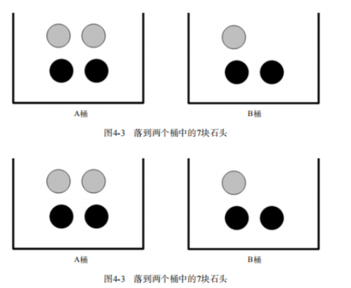
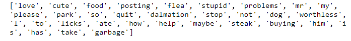

## 概述

### 本章介绍

本章会给出一些使用朴素贝叶斯分类器。我们称之为“朴素”，是因为整个形式过程只做最原始、最简单的假设。不必担心，你会详细了解到这些假设。我们将充分利用Python的文本处理能力将文档切分成词向量，然后利用词向量对文档进行分类。我们还将构建另一个分类器，观察其在真实的垃圾邮件数据集中的过滤效果，必要时还会回顾一下条件概率。最后，我们将介绍如何从个人发布的大量广告中学习分类器，并将学习结果转换成人类可理解的信息。

前两章要求分类器做出艰难决策，给出 “该数据实例属于哪一类”这类问题的明确答案。不过，分类器有时会产生错误结果，这时可以要求 分类器给出一个最优的类别猜测结果，同时给出这个猜测的概率估计值。

概率论是许多机器学习算法的基础，所以深刻理解这一主题就显得十分重要。第3章在计算特征值取某个值的概率时涉及了一些概率知识，在那里先统计特征在数据集中取某个特定值的次数，然后除以数据集的实例总数，就得到了特征取该值的概率。我们将在此基础上深入讨论。

本章会给出一些使用概率论进行分类的方法。首先从一个最简单的概率分类器开始，然后给出一些假设来学习朴素贝叶斯分类器。称之为“朴素”，是因为整个形式化过程只做最原始、最简单的假设。不必担心，你会详细了解到这些假设。我们将充分利用Python的文本处理能力将文档切分成词向量，然后利用词向量对文档进行分类。我们将还构建另一个分类器，观察其在真实的垃圾邮件中的过滤效果，必要时还会回顾一下条件概率。

### 基于贝叶斯决策理论的分类方法
朴素贝叶斯
优点：在数据较少的情况下仍然有效，可以处理多类别问题。
缺点：对于输入数据的准备方式较为敏感。
适用数据类型：标称型数据。

朴素贝叶斯是贝叶斯决策理论的一部分，所以讲述朴素贝叶斯之前有必要快速了解一下贝叶斯决策理论。

假设现在有一个数据集，它由两类数据组成（红色和蓝色），数据分布如下图所示。


我们现在用 p1(x,y) p1(x,y)p1(x,y) 表示数据点 (x,y) (x,y)(x,y) 属于类别（图中红色圆点表示的类别）的概率，用 p2(x,y) p2(x,y)p2(x,y) 表示数据点 (x,y) (x,y)(x,y) 属于类别2（图中蓝色三角形表示的类别）的概率，那么对于一个新数据点 (x,y) (x,y)(x,y)，可以用下面的规则来判断它的类别：
- 假设p1(x,y)>p2(x,y)，那么类别为1
- 如果p2(x,y)>p1(x,y)，那么类别为2 

也就是说，会 选择高概率所对应的类别。这就是贝叶斯决策理论的核心思想，即选择具有最高概率的决策。回到上图中，如果该图中的整个数据使用6个浮点数（整个数据由两类不同分布的数据构成，有可能只需要6个统计参数来描述）来表示，并且计算类别概率的Python代码只有两行，那么你会更倾向于使用下面哪种方法来对该数据点进行分类？

(1)使用第1章的kNN，进行1000次距离计算；
(2)使用第2章的决策树，分别沿x轴、y轴划分数据；
(3)计算数据点属于每个类别的概率，并进行比较。
使用决策树不会非常成功；而和简单的概率计算相比，kNN的计算量太大。因此，对于上述问题，最佳选择是使用刚才提到的概率比较方法。

接下来，我们必须要详述p1及p1概率计算方法。

贝叶斯？？？

这里使用的概率解释属于贝叶斯概率理论的范畴，该理论非常流行且效果良好。贝叶斯概率以18世纪的一位神学家托马斯·贝叶斯（Thomas Bayes）的名字命名。贝叶斯概率 引入先验知识和逻辑推理 来处理不确定命题。另一种概率解释称为频数概率（frequency probability），它只从数据本身获得结论，并不考虑逻辑推理及先验知识。


## 数学知识准备
 
### 条件概率

接下来花点时间讲讲概率与条件概率。如果你对p(x,y|c_1)符合很熟悉，那么可以跳过本节。

假设现在有一个装了7块石头的罐子，其中3块是灰色的，4块是黑色的。如果从罐子中随机取出一块石头，那么是灰色石头的可能性是多少？由于取石头有7种可能，其中3种为灰色，所以取出灰色石头的概率为3/7。那么取到黑色石头的概率又是多少呢？很显然，是4/7。我们使用P(gray)来表示取到灰色石头的概率，其概率值可以通过灰色石头数目除以总的石头数目来得到。



要计算P(gray)或者P(black)，事先得知道石头所在桶的信息会不会改变结果？你有可能已经想到计算从B桶中取到灰色石头的概率的办法，这就是所谓的 条件概率（conditionalprobability）。假定计算的是从B桶取到灰色石头的概率，这个概率可以记作P(gray|bucketB)，我们称之为“在已知石头出自B桶的条件下，取出灰色石头的概率”。不难得到，P(gray|bucketA)值为2/4，P(gray|bucketB) 的值为1/3。

条件概率的计算公式如下所示：
$$p(gray|bucketB)=p(gray and bucketB)/p(bucketB)$$

我们来看看上述公式是否合理：

- 首先，用B桶中灰色石头的个数除以两个桶中总的石头数，得到p(gray and bucketB) = 1/7。
- 其次，由于B桶中有3块石头，而总石头数为7，于是p(bucketB)就等于3/7。
- 最后，有p(gray|bucketB) = p(gray and bucketB)/p(bucketB) =(1/7) / (3/7) = 1/3

这个公式虽然对于这个简单例子来说有点复杂，但当存在更多特征时是非常有效的。用代数方法计算条件概率时，该公式也很有用。

另一种有效计算条件概率的方法称为 贝叶斯准则。贝叶斯准则告诉我们如何交换条件概率中的条件与结果，即如果已知p(x|c)，要求p(c|x)，那么可以使用下面的计算方法：

$$p(c|x)=\frac{p(x|c)*p(c)}{p(x)}$$


### 全概率

条件概率（Condittional probability），就是指在事件B发生的情况下，事件A发生的概率，可以用p(A|B)

$$p(A|B)=\frac{p(A \cap B)}{p(B)}$$

$$p(A \cap B)=p(A|B)*p(B)$$
又因为：
$$p(A \cap B) = p(B|A)*p(A)$$
所以：

$$p(A|B) = \frac{p(B|A)*P(A)}{P(B)}$$

全概率公式：若事件A1，A2，…，An构成一个完备事件组且都有正概率，则对任意一个事件B都有公式成立。
$$p(B)=p(BA_1)+P(BA_2)+...+P(BA_n)$$
$$=p(B|A_1)*P(A_1)+p(B|A_2)*P(A_2)+...+p(B|A_n)*P(A_n)$$
$$=\sum_{i=1}^n p(A_i)*p(B|A_i)$$

$$p(B)=\sum_{i=1}^n p(A_i)*p(B|A_i)$$


### 使用条件概率来进行分类

假设这里要被分类的类别有两类，类c1和类c2，那么我们需要计算概率p1(x,y)和p2(x,y)的大小并进行比较：

若p1(x,y)>p2(x,y)，那么属于类别1

若p1(x,y)<p2(x,y)，那么属于类别2

使用p1()和p2()只是为了尽可能简化描述，而真正需要计算和比较的是p(c1|x,y)和p(c2|x,y)。这些符号所代表的具体意义是：给定某个由x、y表示的数据点，那么该数据点来自类别c1的概率是多少？数据点来自类别c2的概率又是多少？。

$$p(c_i|x,y)=\frac{p(x,y|c_i)*p(c_i)}{p(x,y)}$$

若p(c1|x,y)>p(c2|x,y)，那么属于类别c1

若p(c1|x,y)<p(c2|x,y)，那么属于类别c2

使用贝叶斯准则，可以通过已知的三个概率值来计算未知的概率值。后面就会给出利用贝叶斯准则来计算概率并对数据进行分类的代码。


## 使用朴素贝叶斯进行文档分类

机器学习的一个重要应用就是文档的自动分类。在分类文档中，整个文档（如一封电子邮件）是实例，而电子邮件中的某些元素则构成特征。虽然电子邮件是一种会不断增加的文本，但我们同样也可以对新闻报道、用户留言、政府公文等其他任意类型的文本进行分类。我们可以观察文档中出现的词，并把每个词的出现或者不出现作为一个特征，这样得到的特征数目就会跟词汇表中的词目一样多。

### 使用Python进行文本分类

要从文本中获取特征，需要先拆分文本。具体如何做呢？这里的特征是来自文本的词条（token），一个词条是字符的任意组合。可以把词条想象为单词，也可以是非单词词条，如URL、IP地址或者任意其他字符串。然后将每一个文本片段表示为一个词条向量，其中值为1表示出现在文档中，0表示词条未出现。

接下来首先给出将文本转换为数字向量的过程，然后介绍如何基于这些向量来计算条件概率，并在此基础上构建分类器，最后还要介绍一些利用Python实现朴素贝叶斯过程中需要考虑的问题。

### 从文本中构建词向量

我们将文本看成单词向量或者词条向量，也就是说句子转换为向量。考虑出现在所有文档中的所有单词，在决定将哪些词纳入词汇表或者说所要的词汇集合。


```
def loadDataSet():
    '''
    函数功能：
            创建数据集
    函数参数：
            无
    函数返回：
            返回创建成功的数据集，类别标签
    '''
    # 每一行代表一个文档
    postingList=[['my', 'dog', 'has', 'flea', 'problems', 'help', 'please'],         # 创建数据
                 ['maybe', 'not', 'take', 'him', 'to', 'dog', 'park', 'stupid'],
                 ['my', 'dalmation', 'is', 'so', 'cute', 'I', 'love', 'him'],
                 ['stop', 'posting', 'stupid', 'worthless', 'garbage'],
                 ['mr', 'licks', 'ate', 'my', 'steak', 'how', 'to', 'stop', 'him'],
                 ['quit', 'buying', 'worthless', 'dog', 'food', 'stupid']]
    classVec = [0,1,0,1,0,1]               # 由人工标注的每篇文档的类标签，1代表侮辱类词汇，0代表非侮辱类词汇
    return postingList,classVec            # 返回数据集，类别标签

# 函数测试
postingList, classVec = loadDataSet()
print(postingList)
print('\n')
print(classVec)
```


```
def createVocabList(dataSet):
    '''
    函数功能：
            创建一个包含在所有文档中出现的不重复词的词表
    函数参数：
            dataSet__数据集
    函数返回：
            不重复词的列表
    '''
    vocabSet = set([])                       #创建一个空的不重复列表(存放词条)
    for document in dataSet:                 # 遍历dataSet中的每一篇文档
        vocabSet = vocabSet | set(document)  # 与vocabSet取并集，向vocabSet中添加没有出现的新词条    
    return list(vocabSet)                    # 将集合转化为列表

# 函数测试
postingList,classVec  =loadDataSet()
print(createVocabList(postingList))
```



函数createVocabList()创建了一个包在所有文档中出现的不重复词的列表。

```
def setofWords2Vec(vocabList, inputSet):
    '''
    函数说明：
            根据vocabList词汇表，将inputSet进行向量化(出现的词表示为1，否则为0)
    函数参数：
            vocabList__词汇表
            inputSet__词条数据每一个列表向量
    '''
    returnVec = [0] * len(vocabList)                               #创建一个其中所含元素都为0的向量
    for word in inputSet:                                          #遍历每个词条
        if word in vocabList:                                      #如果词条存在于词汇表中，则置1
            returnVec[vocabList.index(word)] = 1
        else: 
            print("the word: %s is not in my Vocabulary!" % word)
    return returnVec                                               # 返回文档向量

# 函数测试
postingList, classVec = loadDataSet()
vocabList = createVocabList(postingList)
print(setofWords2Vec(vocabList,postingList[0] ))
```


获得词汇表后，可以使用函数setofWords2Vec()，该函数的输入参数为词汇表及某个文档，输出的是文档向量，向量的每一元素为1为0，分别表示词汇表中的单词在输入文档中是否出现。

### 训练算法：从词向量计算概率

这里将之前的x、y替换为w。粗体w表示这是一个向量，即它，即它由多个数值组成。数值的个数与词汇表中的词个数相同

$$p(c_i|w)=\frac{p(w|c_i)*p(c_i)}{p(w)}$$

具体地，首先，可以通过统计各个类别的文档数目除以总得文档数目，计算出相应的p(ci)；然后，基于条件独立性假设，将w展开为一个个的独立特征，那么就可以将上述公式写为$p(w|c_i)=p(w0|c_i)*p(w1|c_i)*...p(w_N|c_i)$,这样就很容易计算，从而极大地简化了计算过程。


```
import numpy as np
def trainNB0(trainMatrix,trainCategory):
    '''
    函数功能：
            利用朴素贝叶斯训练算法
    函数参数：
            trainMatrix__文档矩阵
            trainCategory__每篇文档类别标签所构成的向量
    函数返回：
            p0v__非侮辱类的条件概率
            p1v__侮辱类的条件概率
            pAb__文档属于侮辱类的概率
    '''
    numTrainDocs = len(trainMatrix)                       #计算训练的文档数目
    numWords = len(trainMatrix[0])                        #计算每篇文档的词条数
    pAbusive = sum(trainCategory)/float(numTrainDocs)     #文档属于侮辱类的概率
    p0Num = np.zeros(numWords)
    p1Num = np.zeros(numWords)                            # 创建一个长度和词条数等长的列表
    p0Denom = 0.0                                         # 初始化为0
    p1Denom = 0.0                                         # 初始化为0
    for i in range(numTrainDocs):                         # 遍历每一篇文档的词条向量
        if trainCategory[i] == 1:                         # 如果该词条向量对应的标签为1
            p1Num += trainMatrix[i]                       # 统计所有文档中类别标签为1的词条向量中各个词条出现的次数
            p1Denom += sum(trainMatrix[i])                # 统计所以文档类别标签为1的词条向量中出现的所有词条的数目
        
         # 统计属于侮辱类的条件概率所需的数据
        else:                     
            p0Num += trainMatrix[i]                       # 统计所有文档中类别标签为0的词条向量中各个词条出现的次数
            p0Denom += sum(trainMatrix[i])                # 统计所以文档类别标签为0的词条向量中出现的所有词条的数目
    p1Vect = p1Num/p1Denom                                # 为避免下溢出问题，后面会改为np.log()                   
    p0Vect = p0Num/p0Denom                                # 为避免下溢出问题，后面会改为log()
    return p0Vect,p1Vect,pAbusive                         # 函数返回


# 函数测试
postingList, classVec = loadDataSet()
myVocabList = createVocabList(postingList)
trainMat = []                                             # 创建一个生成训练集向量列表
for postinDoc in postingList:
    trainMat.append(setofWords2Vec(myVocabList, postinDoc))
p0V, p1V, pAb = trainNB0(trainMat, classVec)

print(p1V)
print('\n')
print(p0V)
print('\n')
print(pAb)
```


### 朴素贝叶斯改进之拉普拉斯平滑

利用贝叶斯分类器对文档进行分类时，要计算多个概率的乘积以获得文档属于某个类别的概率，即计算$p(w_0|1)p(w_1|1)p(w_2|1)$。如果其中一个概率值为0，那么最后的乘积也为0。为了降低这种影响，可以将所有词的出现数初始化为1，并将分母初始化为2。这种做法叫做拉普拉斯平滑（Laplace Smoothing）又被称为加1平滑，是比较常用的平滑方法，它就是解决了0概率的问题。

p0Num=np.ones(numWords); p1Num=np.ones(numWords)

p0Denom=2.0; p1Denom=2.0

正如上面所述，由于有太多很小的数相乘。计算概率时，由于大部分因子都非常小，最后相乘的结果四舍五入为0,造成下溢出或者得不到准确的结果，所以，我们可以对成绩取自然对数，即求解对数似然概率。这样，可以避免下溢出或者浮点数舍入导致的错误。同时采用自然对数处理不会有任何损失。下图给出函数f(x)和lnf(x)的曲线。

#p0Vect=log(p0Num/p0Denom); p1Vect=log(p1Num/p1Denom)


检查这两条直线就会发现他们在相同区域内同时增加或者减小，并且在相同带你取到极值。他们的值虽然不停，但不影响最终结果。

### 朴素贝叶斯分类函数


```
import numpy as np
def trainNB0(trainMatrix,trainCategory):
    '''
    函数功能：
            利用朴素贝叶斯训练算法
    函数参数：
            trainMatrix__文档矩阵
            trainCategory__每篇文档类别标签所构成的向量
    函数返回：
            p0v__非侮辱类的条件概率
            p1v__侮辱类的条件概率
            pAb__文档属于侮辱类的概率
    '''
    numTrainDocs = len(trainMatrix)                       #计算训练的文档数目
    numWords = len(trainMatrix[0])                        #计算每篇文档的词条数
    pAbusive = sum(trainCategory)/float(numTrainDocs)     #文档属于侮辱类的概率
    p0Num = np.ones(numWords)
    p1Num = np.ones(numWords)                             # 创建一个长度和词条数等长的列表
    p0Denom = 2.0                                         # 分母初始化为0
    p1Denom = 2.0                                         # 分母初始化为0
    for i in range(numTrainDocs):                         # 遍历每一篇文档的词条向量
        if trainCategory[i] == 1:                         # 如果该词条向量对应的标签为1
            p1Num += trainMatrix[i]                       # 统计所有文档中类别标签为1的词条向量中各个词条出现的次数
            p1Denom += sum(trainMatrix[i])                # 统计所以文档类别标签为1的词条向量中出现的所有词条的数目
        
         # 统计属于侮辱类的条件概率所需的数据
        else:                     
            p0Num += trainMatrix[i]                       # 统计所有文档中类别标签为0的词条向量中各个词条出现的次数
            p0Denom += sum(trainMatrix[i])                # 统计所以文档类别标签为0的词条向量中出现的所有词条的数目
    p1Vect = np.log(p1Num/p1Denom)                        # 为避免下溢出问题，后面会改为np.log()                   
    p0Vect = np.log(p0Num/p0Denom)                        # 为避免下溢出问题，后面会改为log()
    return p0Vect,p1Vect,pAbusive                         # 函数返回


# 函数测试
postingList, classVec = loadDataSet()
myVocabList = createVocabList(postingList)
trainMat = []                                             # 创建一个生成训练集向量列表
for postinDoc in postingList:
    trainMat.append(setofWords2Vec(myVocabList, postinDoc))
p0V, p1V, pAb = trainNB0(trainMat, classVec)

print(p1V)
print('\n')
print(p0V)
print('\n')
print(pAb)
```


通过上面的结果可以看到，没有了0概率的现象。


```
def classifyNB(vec2Classify, p0Vec, p1Vec, pClass1):
    '''
    函数功能：
            朴素贝叶斯分类器分类函数
    函数参数：
            vec2Classify__待分类的词条数组
            p0Vec__非侮辱类的条件概率数组
            p1Vec__侮辱类的条件概率数组
            pClass1__文档属于侮辱类的概率
    '''
    p1 = sum(vec2Classify * p1Vec) + np.log(pClass1)      #element-wise mult
    p0 = sum(vec2Classify * p0Vec) + np.log(1.0 - pClass1)
    if p1 > p0:
        return 1
    else: 
        return 0
```


```
def testingNB():
    '''
    函数说明：
            朴素贝叶斯测试函数
    函数返回：
            测试样本的类别
    '''
    listOPosts,listClasses = loadDataSet()          # 使用loadDataSet()函数创建数据集
    myVocabList = createVocabList(listOPosts)       # 使用createVocabList()函数创建词汇表
    trainMat=[]                                     # 将数据集进行向量化
    for postinDoc in listOPosts:      
        trainMat.append(setofWords2Vec(myVocabList, postinDoc))
    p0V,p1V,pAb = trainNB0(np.array(trainMat),np.array(listClasses))  # 训练朴素贝叶斯分类器
    
    testEntry = ['love', 'my', 'dalmation']                           # 测试样本1
    thisDoc = np.array(setofWords2Vec(myVocabList, testEntry))        # 测试样本1向量化 
    print(testEntry,'classified as: ',classifyNB(thisDoc,p0V,p1V,pAb))# 打印分类结果
    
    testEntry = ['stupid', 'garbage']                                 # 测试样本2
    thisDoc = np.array(setofWords2Vec(myVocabList, testEntry))        # 测试样本2向量化 
    print(testEntry,'classified as: ',classifyNB(thisDoc,p0V,p1V,pAb))# 打印分类结果

    # 函数测试
testingNB()
```


## 使用朴素贝叶斯过滤垃圾邮件

在前面那个简单的例子中，我们引入了字符串列表。使用朴素贝叶斯解决一些现实生活中的问题时，需要先从文本内容得到字符串列表，然后生成词向量。下面这个例子中，我们将了解朴素贝叶斯的一个最著名的应用：电子邮件垃圾过滤。首先看一下如何使用通用框架来解决该问题。

示例：使用朴素贝叶斯对电子邮件进行分类
- (1) 收集数据：提供文本文件。
- (2) 准备数据：将文本文件解析成词条向量。
- (3) 分析数据：检查词条确保解析的正确性。
- (4) 训练算法：使用我们之前建立的trainNB0()函数。
- (5) 测试算法：使用classifyNB()，并且构建一个新的测试函数来计算文档集的错误率。
- (6) 使用算法：构建一个完整的程序对一组文档进行分类，将错分的文档输出到屏幕上。

### 准备数据：切分数据

所有的邮件文本数据放在email文件夹下，这个文件夹下面包含两个文件夹：ham和spam，ham文件夹下放置25个txt格式的非垃圾邮件，spam文件夹下放置了25个txt格式的垃圾邮件


对于一个文本字符串，可以使用Python的string.split()方法将其切分，下面看看实际的运行效果。


```
mySent = "This book is the best book on Python or M.L. I have ever laid eyes upon."
print(mySent.split())
```


可以看到，切分的结果不错，但是标点符号也被当成了词的一部分。可以使用正则表达式来且切分句子，其中分隔符是除单词、数字外的任意字符串。


```
import re                            # 导入re模块

regEx = re.compile('\\W+')           # 根据包含的正则表达式的字符串创建模式对象 
listOfTokens = regEx.split(mySent)
print(listOfTokens)
```


现在得到了一系列词组成的词表，但是里面的空字符串需要去掉。可以计算每个字符串的长度，只返回长度大于0的字符串。


```
[tok  for tok in listOfTokens if len(tok)>0]  # 字符串全部转化为小写
```


我们发现句子中的第一个单词是大写的，如果目的是句子查找，那么这个特点会很有用。但这里的文本只看成词袋，所以我们希望所有的词的形式都是统一的，不论它们出现在句子中间、结尾还是开头。

.lower()__可将字符串全部转换为小写

.upper()__可将自父亲全部转化为大写


```
[tok.lower() for tok in listOfTokens if len(tok)>0]  # 字符串全部转换为小写
```


### 测试算法：使用朴素贝叶斯进行交叉验证

下面将文本解析器集成到一个完整分类器中。


```
def textParse(bigString):
    '''
    函数说明：
            将输入的字符串切分为列表
    函数参数：
            bigString__输入的字符串
    返回：
        切分后的列表
    '''

    listOfTokens = re.split(r'\W+', bigString)
    return [tok.lower() for tok in listOfTokens if len(tok)>2]  #除了单个字母，其它单词变成小写

# 函数测试 
textParse(mySent)
```


```
import random
def spamTest():
    '''
    函数说明：
            测试朴素贝叶斯分类器
    '''
    docList = [] 
    classList = [] 
    fullText = []
    for i in range(1, 26):                                              # 遍历25个txt文件
        wordList = textParse(open('email/spam/%d.txt' %i, 'r').read())  # 获取25个垃圾邮件，并调用textParse函数将字符串进行切分
        docList.append(wordList)                                        # append() 方法向列表的尾部添加一个新的元素  
        fullText.append(wordList)                                       # extend()方法将元素都添加到原有的列表 
        classList.append(1)                                             # 标记垃圾邮件，1表示垃圾文件
        wordList = textParse(open('email/ham/%d.txt' %i, 'r').read())   # 获取25个非件，并调用textParse函数将字符串进行切分
        docList.append(wordList)                                        # append() 方法向列表的尾部添加一个新的元素 
        fullText.append(wordList)                                       # extend()方法将元素都添加到原有的列表  
        classList.append(0)                                             # 标记非垃圾邮件，0表示非垃圾邮件 
    
    vocabList = createVocabList(docList)        # 创建一个不重复词的词表
    trainingSet = list(range(50))               # 创建存储训练集的索引值列表  
    testSet = []                                # 创建测试集的索引值列表
    for i in range(10):                         # 从50个邮件中随机选择10个邮件当做测试集(40个邮件当做训练集)
        randIndex = int(random.uniform(0, len(trainingSet)))            # 随机选取索引值
        testSet.append(trainingSet[randIndex])                          # 添加测试集的索引值   
        del(trainingSet[randIndex])                                     # 在训练集中删除添加到测试集的索引值
    
    trainMat = []                               # 创建训练矩阵  
    trainClasses = []                           # 创建训练集类别标签           
    for docIndex in trainingSet:                                           # 遍历训练集
        trainMat.append(setofWords2Vec(vocabList, docList[docIndex]))      # 将向量化后的词添加至训练矩阵中
        trainClasses.append(classList[docIndex])                           # 将类别标签添加至训练集类别标签中
    p0V, p1V, pSpam = trainNB0(np.array(trainMat), np.array(trainClasses)) # 训练朴素贝叶斯模型
    errorCount = 0                                                         # 错误分类计数(设初始值为0)  
    for docIndex in testSet:                                               # 遍历测试集
        wordVector = setofWords2Vec(vocabList, docList[docIndex])          # 将测试集进行向量化
        if classifyNB(np.array(wordVector), p0V, p1V, pSpam) != classList[docIndex]:   #如果分类错误
            errorCount += 1                                                # 错误计数加1
            print("分类错误的测试集：",docList[docIndex])      
    print('the error rate is:' ,float(errorCount) / len(testSet))

spamTest()
```


函数spamTest()会输出在10封随机选择的电子邮件上的分类错误概率，所以存在误判的情况。这里一直出现的错误是将垃圾邮件误判为正常邮件。相比之下，将垃圾邮件误判为正常邮件要比将正常邮件归为垃圾邮件好。为了避免错误，有多种方式可以用来修正分类器，这些内容会在后续文章中进行讨论。
函数spamTest()会输出在10封随机选择的电子邮件上的分类错误概率，所以存在误判的情况。这里一直出现的错误是将垃圾邮件误判为正常邮件。相比之下，将垃圾邮件误判为正常邮件要比将正常邮件归为垃圾邮件好。为了避免错误，有多种方式可以用来修正分类器，这些内容会在后续文章中进行讨论。
