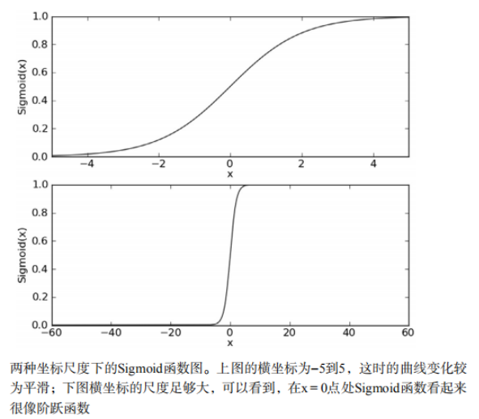
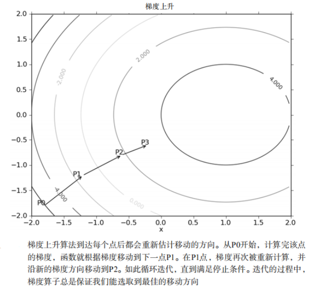
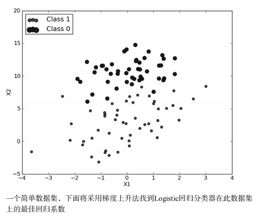
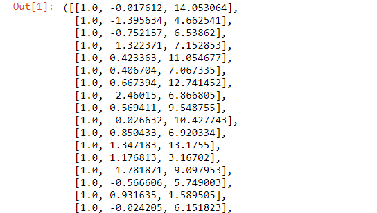
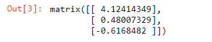
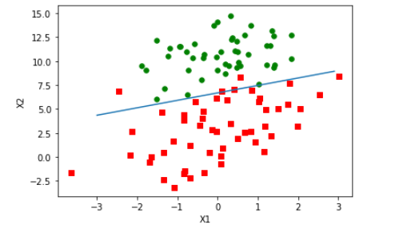
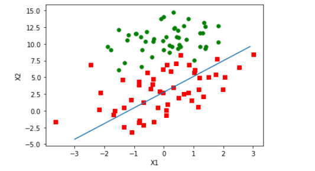
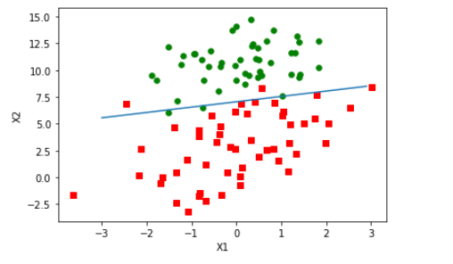
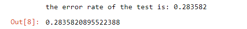
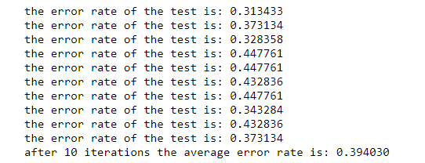

## 本章内容
- Sigmoid函数和Logistic回归分类器
- 最优化理论初步
- 梯度下降最优化算法
- 数据中的缺失项处理


这会是激动人心的一章，因为会首次接触到 最优化算法。仔细想想就会发现，其实日常生活中遇到过很多最优化问题，比如如何在最短时间内从A点到达B点？如何投入最少工作量却获得最大的效益？如何设计发动机使得油耗最少而功率最大？可见，最优化的作用十分强大。接下来会介绍几个最优化算法，并利用它们训练出一个非线性函数用于分类。

假设现在有一些数据点，我们用一条直线对这些点进行拟合(该线称为最佳拟合直线)，这个拟合过程就称作回归。利用Logistic回归进行分类的主要思想是：根据现有数据对分类边界建立回归公式，以此进行分类。这里的“回归”一次源于最佳拟合，表示要找到最佳拟合参数集，其背后的数学分析将在下一部分介绍。训练分类器时的做法就是寻找最佳拟合参数，使用的是最优化算法

### Logistic回归的一般过程

(1) 收集数据：采用任意方法收集数据。
(2) 准备数据：由于需要进行距离计算，因此要求数据类型为数值型。另外，结构化数据格式则最佳。
(3) 分析数据：采用任意方法对数据进行分析。
(4) 训练算法：大部分时间将用于训练，训练的目的是为了找到最佳的分类回归系数。
(5) 测试算法：一旦训练步骤完成，分类将会很快。
(6) 使用算法：首先，我们需要输入一些数据，并将其转换成对应的结构化数值；接着，基于训练好的回归系数就可以对这些数值进行简单的回归计算，判定它们属于哪个类别；在这之后，我们就可以在输出的类别上做一些其他分析工作。

本章首先阐述Logistic回归的定义，然后介绍一些最优化算法，其中包括基本的梯度上升法和一个改进的随机梯度上升法，这些最优化算法将用于分类器的训练。本章最后会给出一个Logistic回归的实例，预测一匹马是否能被治愈。 


## Logistic回归和Sigmoid函数的分类

Logistic回归

优点：计算代价不高，易于理解和实现。
缺点：容易欠拟合，分类精度可能不高。
适用数据类型：数值型和标称型数据。

首先我们想要的函数应该是，能接受所有的输入然后预测出类别。例如，在两个类的情况下，上述函数输出0或1。或许你之前接触过具有这种性质的函数，该函数称为 海维塞德阶跃函数（Heaviside step function），或者直接称为 单位阶跃函数。然而，海维塞德阶跃函数的问题在于：该函数在跳跃点上从0瞬间跳跃到1，这个瞬间跳跃过程有时很难处理。

幸好，另一个函数也有类似的性质（可以输出0或者1），且数学上更易处理，这就是Sigmoid函数。Sigmoid函数具体的计算公式如下：

$$\sigma=\frac{1}{1+e^{-z}} $$

图5-1给出了Sigmoid函数在不同坐标尺度下的两条曲线图。当x为0时，Sigmoid函数值为0.5。随着x的增大，对应的Sigmoid值将逼近于1；而随着x的减小，Sigmoid值将逼近于0。如果横坐标刻度足够大（图中下图），Sigmoid函数看起来很像一个阶跃函数。

因此，为了实现Logistic回归分类器，我们可以在每个特征上都乘以一个回归系数，然后把所有的结果值相加，将这个总和代入Sigmoid函数中，进而得到一个范围在0~1之间的数值。任何大于0.5的数据被分入1类，小于0.5即被归入0类。所以，Logistic回归也可以被看成是一种概率估计。

确定了分类器的函数形式之后，那么现在的问题变成了：最佳回归系数是多少？ 如何确定它们的大小？




## 基于最优化方法的最佳回归系数确定

Sigmoid函数的输入记为z，由下面公式得出：

$$z=w_0x_0+w_1x_1+w_2x_2+...+w_nx_n$$

如果采用向量的写法，上述公式可以写成$z=w^Tx$，它表示将这两个数值向量对应元素相乘然后全部加起来即得到z值。其中的向量x是分类器的输入数据，向量w也就是我们要找到的最佳参数（系数，从而使得分类器尽可能地准确。

下面首先接受梯度上升这一最优化方法，我们将学习到如何使用该方法求得数据集的最佳参数。接下来，展示如何绘制梯度上升产生的决策边界图，该图能将梯度上升的分类效果可视化呈现出来。我们最后将学习随机梯度上升算法，以及如何对其进行修改以获得更好的结果。

### 梯度上升法
我们介绍的第一个个最优化算法叫做梯度上升法。梯度上升法基于的思想是：要找到某函数的最大值，最好的方法是沿着该函数的梯度方向探寻。如果梯度记为$\triangledown $，则函数f(x,y)的梯度由下式表示：

$$\triangledown f(x,y)=\begin{pmatrix}
\frac{\partial f(x,y)}{\partial x}\\ 
\frac{\partial f(x,y)}{\partial y}
\end{pmatrix}$$

这是机器学习中最易造成混淆的一个地方，但在数学上并不难，需要做的只是牢记这些符号的意义。这个梯度意味着要沿x的方向移$\frac{\partial f(x,y)}{\partial x}$，沿y的方向移$\frac{\partial f(x,y)}{\partial y}。其中f(x,y)必须要在待计算的点上有定义并且可微。



上图梯度上升算法沿梯度方向移动了一步。可以看到，梯度算子总是指向函数值增长最快的方向。这里所说的是移动方向，而未提到移动量的大小。该量值称为步长，记做$\alpha$。用向量来表示的话，梯度上升算法的迭代公式如下：

$$w:w+\alpha \triangledown_wf(w)$$

该公式将一直迭代执行，直到达到某个停止条件为止，比如迭代次数达到某个指定值或者算法达到某个可以允许的误差范围。

梯度下降算法

你最经常听到的应该是梯度下降算法，它与这里的梯度上升算法是一样的，只是公式中的加法需要变成减法。因此，对应的公式可以写成

$$w:w-\alpha \triangledown_wf(w)$$

梯度上升算法用来求函数的最大值，而梯度下降算法用来求函数的最小值。


基于上面的内容，我们来看一个Logistic回归分类的应用例子



### 训练算法：使用梯度上升找到最佳参数

上图有100个样本点，每个点包含两个数值型特征：X1和X2。在此数据集上，我们将通过使用梯度上升法找到最佳回归系数，也就是拟合出Logistic回归模型的最佳参数。

#### Logistic回归梯度上升优化算法


```
def loadDataSet():
    '''
    函数功能：
            读取数据
    函数返回：
            dataMat__数据列表
            labelMat__标签列表
    '''
    dataMat = []                           # 创建数据列表
    labelMat = []                          # 创建标签列表
    fr = open('testSet.txt')               # 打开testSet文件  
    for line in fr.readlines():            # 读取每一行数据
        # split__split()通过指定分隔符对字符串进行切片
        # strip__strip()方法用于移除字符串头尾指定的字符（默认为空格或换行符）或字符序列
        lineArr = line.strip().split()     
        dataMat.append([1.0, float(lineArr[0]), float(lineArr[1])])  # 添加X0(为了计算方便，将X0设为1.0)
        labelMat.append(int(lineArr[2]))   # 添加标签列表
    return dataMat, labelMat               # 返回数据列表，以及标签列表

# 测试函数
loadDataSet()
```




```
import numpy as np
def sigmoid(inX):
    '''
    函数说明
            sigmoid函数
    函数参数
            inX__数据
    '''
    return 1.0/ (1+np.exp(-inX))  
```

```
def gradAscent(dataMatIn, classLabels):
    '''
    函数说明：
            梯度上升算法
    函数参数
            dataMatIn__数据集
            classLabels__数据标签
    '''
    dataMatrix = np.mat(dataMatIn)                                  # 转换为Numpy矩阵数据类型
    labelMat = np.mat(classLabels).transpose()                      # 转换为Numpy矩阵数据类型，并且转置
    m, n = np.shape(dataMatrix)                                     # 返回dataMatrix的大小。m为行数,n为列数。
    alpha = 0.001                                                   # 学习率
    maxCycles = 500                                                 # 最大迭代次数
    weights = np.ones((n,1))
    for k in range(maxCycles):     
        # 矩阵相乘
        # 100*3->3*1->100*1
        h = sigmoid(dataMatrix * weights)                           # z=w*x
        # 100*1->100*1->100*1
        error = labelMat - h                                        # error = y-h
        # 3*1+ 3*100->100*1->3*1 = 3*1
        weights = weights + alpha * dataMatrix.transpose() * error  # w:w+ alpha * (y-h)*x.T
    return weights                                                  # 返回训练好的回归系数

# 测试函数
dataArr, labelMat = loadDataSet()
gradAscent(dataArr, labelMat)
```



### 分析数据：画出决策边界
上面已经解出一组回归系数，它确定了不同类别数据之间的分隔线。那么咋样画出该分隔线，从而使得优化的过程便于理解呢？下面将解决这个问题。


#### 画出数据集和Logistic回归最佳拟合直线的函数


```
import matplotlib.pyplot as plt
def plotBestFit(weights):
    '''
    函数说明：
            绘制数据集以及最佳拟合直线
    参数说明:
            权重参数
    '''
    dataMat, labelMat = loadDataSet()           # 通过loadDataSet()创建数据集
    dataArr = np.array(dataMat)                 #转换成numpy的array数组
    
    n = np.shape(dataArr)[0]                    # 数据个数    
    xcord1 = []; ycord1 = []                    # 正样本     
    xcord2 = []; ycord2 = []                    # 负样本
    
    for i in range(n):                          # 遍历每一个数据
        if int(labelMat[i]) == 1:               # 若为正样本(1表示为正样本)  
            xcord1.append(dataArr[i,1])
            ycord1.append(dataArr[i,2])
        else:                                   # 若为负样本(0表示为正样本)
            xcord2.append(dataArr[i,1])
            ycord2.append(dataArr[i,2])
    fig = plt.figure()                          # 创建画布
    
    ax = fig.add_subplot(111)                   # 将画布分割成1行1列，图像画在从左到右从上到下的第1个 
    ax.scatter(xcord1,                          # x轴数值 
               ycord1,                          # y轴数值
               s=30,                            # 点的尺寸
               c='red',                         # 颜色
               marker ='s')
    ax.scatter(xcord2,                          # x轴数值   
              ycord2,                           # y轴数值
              s=30,                             # 点的尺寸
              c= 'green')                       # 颜色 
    
    # [60]
    x = np.arange(-3.0, 3.0, 0.1)                   # [60]，x轴数值
    y = (-weights[0] - weights[1] * x) / weights[2] #[1,60]，y轴数值
    y = np.ravel(y)                                 # 将[1,60]->[60]
    ax.plot(x,y)
    plt.xlabel('X1')                       # x轴标题
    plt.ylabel('X2')                       # y轴标题
    plt.show()                             # 显示图像

# 函数测试
dataArr, labelMat = loadDataSet()
weights = gradAscent(dataArr, labelMat)
plotBestFit(weights)
```



这个分类结果相当不错，从图上看只分错了两到四个点。但是，尽管例子简单且数据集很小，这个方法却需要大量的计算（300次乘法）。所以下一节对该算法稍作改进，从而使他可以应用在真实数据集上。

### 训练算法：随机梯度上升

梯度上升算法在每次更新回归系数时都需要遍历整个数据集，该方法在处理100个左右的数据集时尚可，但如果有数十亿样本和成千上万的特征，那么该方法的计算复杂度就太高了。

一种改进方法是一次仅用一个样本点来更新回归系数，该方法称为 随机梯度上升算法。由于可以在新样本到来时对分类器进行增量式更新，因而随机梯度上升算法是一个在线学习算法。与“在线学习”相对应，一次处理所有数据被称作是“批处理”。

随机梯度上升算法可以写成如下的伪代码：
- 所有回归系数初始化为1
- 对数据集中每个样本
    - 计算该样本的梯度
    - 使用alpha × gradient更新回归系数值
- 返回回归系数值

以下是随机梯度上升算法的实现代码。

#### 随机梯度上升算法


```
import numpy as np
def stocGradAscent0(dataMatrix, classLabels):
    '''
    函数说明：
            随机梯度上升算法
    函数参数：
            dataMatrix__数据数组
            classLabels__数据标签
    函数返回：
            回归系数
    '''
    dataMatrix=np.array(dataMatrix)                       # 将数据集列表转换为Numpy数组
    m, n = np.shape(dataMatrix)                           # 通过shape获得数据集的行数和列数   
    alpha = 0.01                                          # 学习率
    weights = np.ones(n)                                  # 初始化权重参数向量且值为1  
    for i in range(m):                                    # 遍历行列表
        h = sigmoid(sum(dataMatrix[i] * weights))         # 计算sigmoid值
        error = classLabels[i] - h                        # 计算误差值
        weights = weights + alpha * error * dataMatrix[i] # 更新回归系数
    return weights                                        # 返回回归系数

# 函数测试
dataArr, labelMat = loadDataSet()
weights = stocGradAscent0(dataArr, labelMat)
plotBestFit(weights)
```



可以看到，随机梯度上升算法与梯度上升算法在代码上很相似，但是有一些区别：第一，后者的变量h和误差error都是向量，而前者则全是数值；第二，前者没有矩阵转换过程，所有变量的数据类型都是Numpy数组。

随机梯度实行完毕后得到的最佳拟合直线图，与梯度上升有一些相似。可以看到，拟合出现的直线效果还不错，但不像梯度上升那样完美。这里的分类器错分了三分之一的样本。

#### 改进的随机梯度上升算法

我们知道，评判一个优化算法的优劣的可靠方法是看其是否收敛，也就是说参数的值是否达到稳定值。此外，当参数值接近稳定时，仍然可能会出现一些小的周期性的波动。这种情况发生的原因是样本集中存在一些不能正确分类的样本点(数据集并非线性可分)，所以这些点在每次迭代时会引发系数的剧烈改变，造成周期性的波动。显然我们希望算法能够避免来回波动，从而收敛到某个值，并且收敛速度也要足够快。

为此，需要对上述随机梯度上升法代码进行适当修改，代码如下：


```
import random
def stocGradAscent1(dataMatrix, classLabels, numIter = 150):
    '''
    函数说明：
            改进的随机梯度上升算法
    函数参数：
            dataMatrix__数据集列表
            classLabels__标签列表
            numIter__迭代次数
    函数返回：
            权重矩阵
    '''
    dataMatrix=np.array(dataMatrix)         # 将数据集列表转换为Numpy数组
    m,n = np.shape(dataMatrix)              # 通过shape获得数据集的行数和列数 
    weights = np.ones(n)                    # 初始化权重参数向量且值为1     
    for j in range(numIter):                # 遍历迭代次数
        dataIndex = list(range(m))          # 获取数据集下标列表 
        for i in range(m):                 # 遍历行列表
            alpha = 4/(1.0+j+i) + 0.01  # alpha值随着迭代次数不断减小，但永远不会减小到0(缓解数据波动)
            randIndex = int(random.uniform(0, len(dataIndex)))  # 随机获取样本
            h = sigmoid(sum(dataMatrix[randIndex] * weights))   # 计算sigmoid值
            error = float(classLabels[randIndex] - h)          # 计算误差值
            weights = weights + alpha * error * dataMatrix[randIndex]#更新回归系数
            # python3.x ,range返回的是range对象，不返回数组对象
             # 删除已经使用的数据(再进行下一次迭代)
            del(dataIndex[randIndex])             
   
    return weights
   
# 函数测试
dataArr, labelMat = loadDataSet()
weights = stocGradAscent1(dataArr, labelMat)
plotBestFit(weights)    
```




上述代码中有两处改进的地方：

- alpha在每次迭代更新是都会调整，这会缓解数据波动或者高频运动。此外，alpha还有一个常数项，目的是为了保证在多次迭代后仍然对新数据具有一定的影响，如果要处理的问题是动态变化的，可以适当加大该常数项，从而确保新的值获得更大的回归系数。
- 第二个改进的地方是选择随机的样本对参数进行更新，由于增加了随机性，这就防止参数值发生周期性的波动。
- 并且采用上述改进算法后，收敛速度更快

目前，我们已经学习了几个优化算法，但还有很多优化算法值得探讨。迄今为止我们分析了回归系数的变化情况，但还没有达到本章的最终目标，即完成具体的分类任务。下一节将使用随机梯度上升算法来解决病马的生死预测问题。

## 示例：从从疝气病症预测病马死亡率

本节将使用Logistic回归来预测患有疝病的马的存活问题。这里的数据包含368个样本和28个特征。我并非育马专家，从一些文献中了解到，疝病是描述马胃肠痛的术语。然而，这种病不一定源自马的胃肠问题，其他问题也可能引发马疝病。该数据集中包含了医院检测马疝病的一些指标，有的指标比较主观，有的指标难以测量，例如马的疼痛级别。

示例：使用Logistic回归估计马疝病的死亡率
- 收集数据：给定数据文件。
- 准备数据：用Python解析文本文件并填充缺失值。
- 分析数据：可视化并观察数据。
- 训练算法：使用优化算法，找到最佳的系数。
- 测试算法：为了量化回归的效果，需要观察错误率。根据错误率决定是否回退到训练阶段，通过改变迭代的次数和步长等参数来得到更好的回归系数。
- 使用算法：实现一个简单的命令行程序来收集马的症状并输出预测结果并非难事。

另外需要说明的是，除了部分指标主观和难以测量外，该数据还存在一个问题，数据集中有30%的值是缺失的。下面将首先介绍如何处理数据集中的数据缺失问题，然后再利用Logistic回归和随机梯度上升算法来预测病马的生死。

### 准备数据：处理数据中的缺失值
数据中的缺失值是个非常棘手的问题，有很多文献都致力于解决这个问题。那么，数据缺失究竟带来了什么问题？假设有100个样本和20个特征，这些数据都是机器收集回来的。若机器上的某个传感器损坏导致一个特征无效时该怎么办？此时是否要扔掉整个数据？这种情况下，另外19个特征怎么办？它们是否还可用？答案是肯定的。因为有时候数据相当昂贵，扔掉和重新获取都是不可取的，所以必须采用一些方法来解决这个问题。

下面给出了一些可选的做法：
- 使用可用特征的均值来填补缺失值；
- 使用特殊值来填补缺失值，如 -1；
- 忽略有缺失值的样本；
- 使用相似样本的均值添补缺失值；
- 使用另外的机器学习算法预测缺失值。

现在，我们对要使用的数据进行预处理，使其可以顺利地使用分类算法。在预处理需要做两件事：第一，所有的缺失值必须用一个实数值来替换，因为我们使用的Numpy数据类型不允许包含缺失值。这里选择实数0来替换所有缺失值，恰好能适用于Logistic回归。这样做的直觉在于，我们需要的是一个在更新时不会影响系数的值。

另外，由于sigmoid(0)=0.5，即它对结果的预测不具由任何倾向性，因此上述做法也不会对误差项造成任何影响。

预处理中做的第二件事是：如果测试集中一条数据的特征值已经缺失，那么我们简单做法是将该条数据丢弃。

原始的数据集经过预处理之后保存成两个文件：horseColicTest.txt和horseColicTraining.txt。现在我们有一个“干净”可用的数据集和一个不错的优化算法。下面将把这些部分融合在一起训练出一个分类器，然后利用该分类器来预测病马的生死问题。


### 测试算法：用Logistic回归进行分类

本章前面几节介绍了优化算法，但目前为止还没有在分类上做任何实际尝试。使用Logistic回归方法进行分类并不需要做很多工作，所需做的只是把测试集上每个特征向量乘以最优化方法得来的回归系数，再将该乘积结果求和，最后输入到Sigmoid函数中即可。如果对应的Sigmoid值大于0.5就预测类别标签为1，否则为0。


```
def classifyVector(inX, weights):
    '''
    函数说明：
            决策分类(大于0.5为一类，小于0.5为一类)
    函数参数：
            inX__特征向量
            weights__回归系数
    '''
    prob = sigmoid(sum(inX *weights))   # z=w*x
    if prob > 0.5:                      # 大于0.5为一类   
        return 1.0
    else:                               # 小于0.5为一类
        return 0.0
```


```
def colicTest():
    '''
    函数说明：
            logistic回归预测
    '''
    frTrain = open('horseColicTraining.txt')                 # 打开训练数据集
    frTest = open('horseColicTest.txt')                      # 打开测试数据集
    trainingSet = []                                         # 创建保存训练数据集的列表
    trainingLabels = []                                      # 创建保存标签的列表
    for line in frTrain.readlines():                         # 遍历每个样本的特征
        # split__split()通过指定分隔符对字符串进行切片
        # strip__strip()方法用于移除字符串头尾指定的字符（默认为空格或换行符）或字符序列
        currLine = line.strip().split('\t')                  
        lineArr = []                                         # 创建列表每个样本的特征向量
        for i in range(21):                                  # 遍历每个样本的特征
            lineArr.append(float(currLine[i]))               # 将样本的特征存储在lineArr列表
        trainingSet.append(lineArr)                          # 将样本的特征向量存储入数据集列表中
        trainingLabels.append(float(currLine[21]))           # 将标签列表存储入标签列表
        trainWeights = stocGradAscent1(np.array(trainingSet), trainingLabels, 500)        #使用改进的随即上升梯度训练
    errorCount = 0                                           # 统计测试数据集预测错误的样本数量
    numTestVec = 0.0                                         # 统计测试数据的样本总数 
    for line in frTest.readlines():                          # 遍历数据集的每个样本
        numTestVec += 1.0                                    # 样本总数+1
        # split__split()通过指定分隔符对字符串进行切片
        # strip__strip()方法用于移除字符串头尾指定的字符（默认为空格或换行符）或字符序列
        currLine = line.strip().split('\t')
        lineArr =[]                                          # 创建特征向量列表
        for i in range(21):                                  # 遍历每个样本的特征     
            lineArr.append(float(currLine[i]))               # 将样本的特征存储在lineArr列表
        #利用分类预测函数对该样本进行预测，并与样本标签进行比较
        if int(classifyVector(np.array(lineArr), trainWeights))!= int(currLine[21]):
            errorCount += 1                                  # 如果预测错误，错误数+1
    errorRate = (float(errorCount)/numTestVec)               # 错误率计算
    print("the error rate of the test is: %f" % errorRate)
    return errorRate

# 测试函数
colicTest()
```




```
def multiTest():
    '''
    函数说明：
            调用函数colicTest()10次并求结果的平均值
    '''
    numTests = 10
    errorSum = 0.0
    for k in range(numTests):
        errorSum += colicTest()
    print('after %d iterations the average error rate is: %f'%(numTests, errorRateSum / float(numTests)))

# 测试函数
multiTest()
```


从上面的结果可以看到，10次迭代求平均错误率为39%。事实上这个结果并不差，因为有30%的数据缺失。当然，如果调整colicTest()中的迭代次数和stocGradAscent1()的步长，平均错误率可以降到20%左右。

## 本章小结

Logistic回归的目的是寻找一个非线性函数Sigmoid的最佳拟合参数，求解过程可以由优化算法来完成。在最优化算法中，最常用的就是梯度上升算法，而梯度上升算法可以简化为随机梯度上升法。

随机梯度上升算法与梯度上升算法的效果相当，但占用更少的计算资源。此外，随机梯度上升使一个在线算法，它可以在新的数据到来时就完成参数更新，而不需要重新读取整个数据集来进行批处理运算。